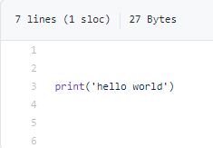

## My first Python Learning Note

  Note it !!!

#### Part1 . How to print hello world

  Yoyoyo ,this code is `print('hello world!!!')`

  [See the code](./test.py)

  

1. testst
2. hhshsh
3. sjsjsj

* 123123
* 5454545
* 6546546

